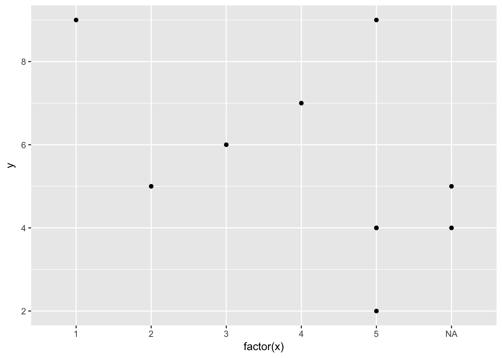
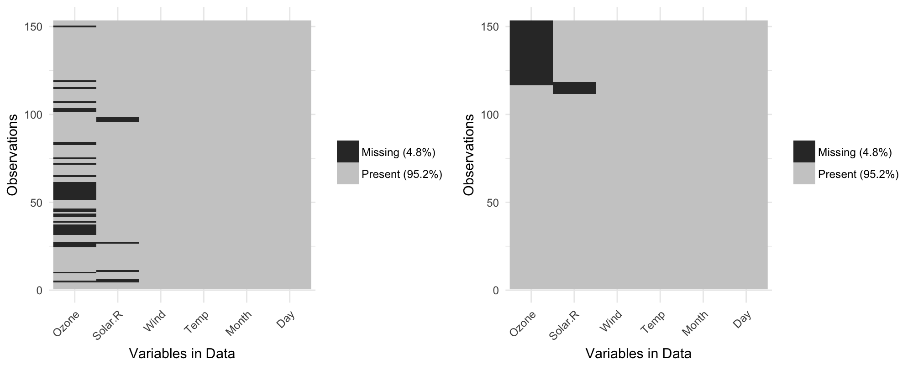
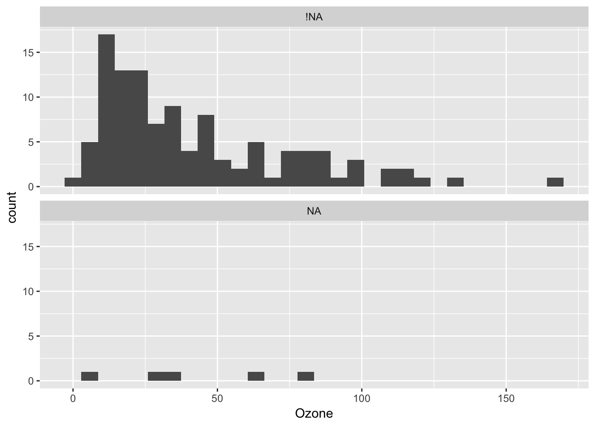

# naniar: Expanding ggplot2 for better visual exploration missingsness
Nicholas Tierney  
14/12/2016  


# Introduction

Missing data is ubiquitous in data analysis, and are often the source of much energy, frustration, and confusion. Since 2014 there has been substantial development in the area of "tidy data" [ @wickham], which states the (surprisingly simple!) rule that each row is an observation and each column is a variable, which makes it easy to reason with data. This paper describes approaches for summarising missing data in numerical and graphical forms whilst maintaining a tidy format.

# Types of missing data

Canonical sources of missing data are questionnaires. Data obtained from questionnaires are often subject to both unknown and known missingness structure. For example, unknown missing data structure can arise from respondents accidentally failing to answer questions or inadvertently providing inappropriate answers. Known missing data structure data may arise due to the structure of the questionnaire. For example, the first question on a survey might be: 'If YES, skip to question 4', resulting in questions 2 and 3 missing. If the structure of the questionnaire is known, this type of missingness can be evaluated easily. However, if this information is not available, the mechanism responsible for producing missing data must be inferred from the data.

Another common source of known and unknown structured missingness is medical examination data. The results of particular medical tests may be: missing for purely random reasons, missing due to the procedure, or missing based on decisions arising from the observed data. For example, a young patient is young may not be subjected to neurodegenerative tests reserved for older workers. A final example is dropouts in a longitudinal study, where participants do not return for future testing sessions. In this case, it is difficult, sometimes impossible, to ascertain the reason for the dropouts, and hence, whether the missingness structure. However, this ascertainment is essential if the estimates based on these data are to be believed as unbiased, [@Simon1986; @Little1988; @Rubin1976].

Other categories of missing data are sometimes identified: Missing Completeley at Random (MCAR), Missing At Random (MAR), and Missing Not At Random (MNAR) [ @Little2002]. MCAR describes where missingness has no association with the observed or unobserved data. MAR describes cases where missingness depends on data observed, but not data unobserved. MNAR is where the missingness of the response is related to an unobserved value relevant to the assessment of interest.

XXX How have you met missings before? What examples of data were you working with that had missing value problems?

## Existing packages for handling missing data

XXX Describe exisiting packages, and group them into what they do

Software for focusson on missing data typically focus on imputation or visualisation. Imputation packages include software from the R ecosystem: mice, Hmisc, mi, Amelia, and mitools. Visualisation packages include The R package VIM, and the stand alone softwares  MissingDataGUI, and MANET.


Mice provides imputation methods, diagnostics, and for user-written imputation functions, among many other features.


XXX Four sentences on MANET, and ggobi handling of missings

MANET stands for Missings Are Now Equally Treated. MANET provided univariate visualisations of missing data, and provided interactive linking to visualise where missing data fell on each value of an analysis. This utilised a referential plot displaying the proportion of missingness for each variable as a filled bar plot, and then a barplot (for categorical data), or a histogram (for continuous data), which highlighted which values of one variable were in the same row as a missing value. ggobi provided multivariate visualisation of missing data using a reference plot that provided a visual cross-tabulation of the data according to missing or not missing, and then a parallel coordinate plot that linked whichever values from the reference plot to then display on the parallel coordinate plot.

XXX One sentence on why MissingDataGUI is too heavy weight for general purpose

MissingDataGUI provides a user interface for exploring missing data structure both numerically and visually, it also provides visualisation methods for visualising imputated values. A limitation of MissingDataGUI is that it breaks workflow by being a separate part of analysis, where one might be performing an analysis using R, using Also being separate from 

XXX One paragraph on how ggplot2 handles missing values (or not): a message is printed and then the missings are ignored

ggplot2, a very popular package for producing graphics in R, does not provide much support for visualisation of missing data, instead printing out a warning message stating that it has removed a particular number of rows containing "non-finite" values. Although ggplot does provide visualisation for missing data when the values being plotted are categories, it treats one of the categories as a NA value.

See some examples below (not for the paper, but for explaining right now:


```r
data_test <- data_frame(x = c(1,2,3,4,5,5,5,5,NA,NA),
                        y = c(9,5,6,7,4,9,2,4,4,5))

  ggplot(data_test,
         aes(x = factor(x),
             y = y)) + 
  geom_bar(stat = "identity")
```

<!-- -->

```r
  ggplot(data_test,
         aes(x = factor(x),
             y = y)) + 
  geom_boxplot()
```

<!-- -->

```r
  ggplot(data_test,
         aes(x = factor(x),
             y = y)) + 
  geom_point()
```

<!-- -->

# Data structures for missing data


```r
# create a simple example of missing data for the paper to illustrate the shadow matrix
df_example <-  tibble::tribble(~V1, ~V2, ~V3, ~V4,
                               "A", 15, 1.2, NA,
                               "A", NA, NA, T,
                               "A", 18, NA, F,
                               "B", 5, 1.6, T,
                               "B", NA, 0.7, T,
                               "B", 12, NA, F)
```


Representing missing data structure is achieed using the shadow matrix, introduced in Swayne and Buja [-@Swayne1998]. The shadow matrix is the same dimension as the data, and consists of binary indicators of "missingness" of data values. In our case, missing is represented as "NA", and not missing is represented as "!NA", although these may be represented as 1 and 0, respectively. This helps us explicitly describe the missingness structure. Representing it as its own separate matrix also helps us separate out the multivariate nature of missing data, as different cases have missing values in different sets of variables.

The shadow matrix is represented below:


```
## # A tibble: 6 × 4
##    V1_NA  V2_NA  V3_NA  V4_NA
##   <fctr> <fctr> <fctr> <fctr>
## 1    !NA    !NA    !NA     NA
## 2    !NA     NA     NA    !NA
## 3    !NA    !NA     NA    !NA
## 4    !NA    !NA    !NA    !NA
## 5    !NA     NA    !NA    !NA
## 6    !NA    !NA     NA    !NA
```

It can also be bound in a wide format, column-wise, to the existing datastructure, adding the suffix "_NA" to the data.


```r
bind_shadow(df_example)
```

```
## # A tibble: 6 × 8
##      V1    V2    V3    V4  V1_NA  V2_NA  V3_NA  V4_NA
##   <chr> <dbl> <dbl> <lgl> <fctr> <fctr> <fctr> <fctr>
## 1     A    15   1.2    NA    !NA    !NA    !NA     NA
## 2     A    NA    NA  TRUE    !NA     NA     NA    !NA
## 3     A    18    NA FALSE    !NA    !NA     NA    !NA
## 4     B     5   1.6  TRUE    !NA    !NA    !NA    !NA
## 5     B    NA   0.7  TRUE    !NA     NA    !NA    !NA
## 6     B    12    NA FALSE    !NA    !NA     NA    !NA
```

Another format is to display it in long form, as below:


```r
as_shadow(df_example) %>%
  mutate(rows = 1:nrow(.)) %>%
  gather(key = "var",
         value = "miss",
         -rows)
```

```
## # A tibble: 24 × 3
##     rows   var  miss
##    <int> <chr> <chr>
## 1      1 V1_NA   !NA
## 2      2 V1_NA   !NA
## 3      3 V1_NA   !NA
## 4      4 V1_NA   !NA
## 5      5 V1_NA   !NA
## 6      6 V1_NA   !NA
## 7      1 V2_NA   !NA
## 8      2 V2_NA    NA
## 9      3 V2_NA   !NA
## 10     4 V2_NA   !NA
## # ... with 14 more rows
```


## Visualisation of missing data

**Heatmap (plot of the long form)**

One common method for visualising missing data is to display a heatmap of the shadow matrix. This approach can be very helpful for giving an overview of which variables contain the most missingness. Methods can also be applied to rearrange rows and columns to find clusters, and identify other interesting features of the data that may have previously been hidden or unclear. This method is shown below using the `vis_miss` from the `visdat` package.


```r
library(visdat)
vis_miss(airquality)
```

<!-- -->

Similar approaches has been used in other missing data packages such as VIM, mi, Amelia, and MissingDataGUI, however the `vis_miss` function provides a much cleaner interface and provides the plot in ggplot, which allows for the user to alter and update the figure as they need. To produce this plot, the data is required to be in the long shadow form.

Facetted plots

An advantage of the wide shadow format is that it allows for referring to missingness of other variables along the values of another variable. For example:


```r
ggplot(data = bind_shadow(airquality),
       aes(x = Ozone)) + 
  geom_histogram() + 
  facet_wrap(~Solar.R_NA,
             ncol = 1)
```

```
## `stat_bin()` using `bins = 30`. Pick better value with `binwidth`.
```

```
## Warning: Removed 37 rows containing non-finite values (stat_bin).
```

<!-- -->

```r
ggplot(data = bind_shadow(airquality),
       aes(x = Ozone,
           colour = Solar.R_NA)) + 
  geom_density()
```

```
## Warning: Removed 37 rows containing non-finite values (stat_density).
```

<!-- -->


This plot shows a histogram of Ozone, showing what the distribution of Ozone is when Solar.R is missing.

Explain how the data structure facilitates these vis with ggplot2

Using this data structure faciliatates the visualisation with ggplot as it means that the user can just refer to the variable that they want to explore the missing structure on. In the case above, the user is looking at a histogram of Ozone, but is then able to look at how many, and which Ozone values are afected by the presence or Absence of Solar.R - Solar Radiation.

A similar method of visualisation could also be explored using `geom_missing_point()` from the ggmissing package:


```r
ggplot(data = airquality,
       aes(x = Ozone,
           y = Solar.R)) + 
  geom_missing_point()
```

<!-- -->

This utilises methods from ggobi and Manet, where missing (NA) values are replaced with values 10% lower than the minimum value in that variable. The missing values are also different colours, so that missingness becomes preattentive.

## Usage

Numerical summaries of missing data are also made easy with some helper functions from The `ggmissing` package provides functions for summarising missing data, for example finding the overall proportion of missing values in a dataset is obtained with `percent_missing_df(data)`, in our case of using our dataset, we find that 3.0061141% of the data has missing values. similarly, we can find the proportion of cases that contain a missing value with `percent_missing_case`, giving 23.2336957%, and the proportion of variables that contain a missing value with `percent_missing_var(tao)` = 37.5.


Conditional summaries, or summaries grouped by another variable.

summary windows present 
- % of values that are missing
- % of varaibles containing missings
- the percent of cases that have at least one missing value
- tabulation of the number of values missing per case.

This study is taken from the R package norm, and MissingDataGUI


it would be really cool if we could implement dplyr `group_by` syntax for the data, to produce summaries of missingness for 1993 and
1997 respectively.

Numerical summaries can occur at a few different levels

Single number summaries:

- The proportion elements in dataset that contains missing values
- The proportion of variables that contain any missing values
- the proportion of cases that contain any missing values

tabular summaries:
- The proportion of missings in every column (variable)
- the proportion of missings in every row (case)

further summaries that use more steps:
table_missing_case(airquality)
table_missing_var(airquality)


summaries that return dataframes:


```r
summary_missing_var(airquality)
```

```
## # A tibble: 6 × 3
##   variable n_missing   percent
##      <chr>     <int>     <dbl>
## 1    Ozone        37 24.183007
## 2  Solar.R         7  4.575163
## 3     Wind         0  0.000000
## 4     Temp         0  0.000000
## 5    Month         0  0.000000
## 6      Day         0  0.000000
```

```r
summary_missing_case(airquality)
```

```
## # A tibble: 153 × 3
##     case n_missing  percent
##    <int>     <int>    <dbl>
## 1      1         0  0.00000
## 2      2         0  0.00000
## 3      3         0  0.00000
## 4      4         0  0.00000
## 5      5         2 33.33333
## 6      6         1 16.66667
## 7      7         0  0.00000
## 8      8         0  0.00000
## 9      9         0  0.00000
## 10    10         1 16.66667
## # ... with 143 more rows
```


# Discussion

You can also write a few sentences on computing on the fly vs data storage

Future work could also explore model-based approaches for exploring  based missing data structures.

# Extras

### Defining missing data and its various forms.

It is helpful to first define what missing data is, and what it is not. Missing data is data that we know should exist, but for some particular reason is not recorded. For example, if there is temperature data recorded every hour of every day, and one particular hour is missing on a particular day, this is missing data. This is contrasted to data that does not exist at all, for example, combining person-level data with environment level data - A person would not have an ambient temperature, and an environment does not have a pulse. These data are sometimes referred to as NULL data, or non-data. 

One of the motivations for understanding structure of missing data is to understand *why* it is missing in the first place. In the example above for the temperature data, the temperature might not have been recorded due to instrument failure, or system-wide shut down, perhaps it was scheduled for maintenance. 

This means that when answering the question "is this data entry filled?" one must actually consider three possible answers: "Yes", "No, but it can be", and "No, and it cannot be".

### Previous examples of missing data
For example, assessments of lung function taken at a workplace may be missing for workers who are on vacation. If there is no known or measurable relationship between the timing of the tests and the timing of vacations, and if the other relevant features of the workers who are on vacation at the time of the tests are similar to that of other workers, then these missing data can be considered MCAR. 

 For example if the missing lung function data occurs in workers who are being assessed for depression, and if there is no relationship between lung function and depression, then it can be considered as MAR.  For example, if BMI is of interest, but those with especially large BMIs are more likely to have missing BMI data, these data can be considered as MNAR. It is important for researchers to recognise MNAR as it introduces bias into the estimation of associations and parameters of interest. For example, if lung function and BMI are negatively correlated, an estimate of BMI based on the MNAR may be too low.

These three varieties of missing data could be further divided into a knowable structure (MAR) or an unknown structure (MAR or MNAR), where the process driving data becoming missing are either known or unknown, and structure refers to variables and interactions that may influence missingness. Data MCAR are without a missingness structure, as missingness does not have any dependence on other variables. Determining whether this is known or unknown is important for determining whether bias may be introduced into the analysis.

### on tests for missing data

Tests confirming whether data is MCAR or not are very useful as they open up the doors for the use of standard multiple imputation techniques.  As described by Little,who proposed a single test statistic for testing MCAR, involving an evaluation of equality of means between identified missing data groups. Rejection of this test result gives strong evidence that the data are not MCAR. Little's test of MCAR is widely used today, especially in social science8 and medical research.9 Recent research has also provided statistical tests and software that evaluate missing data via patterns, equality of means, and homogeneity of variance, and allow for non-normal data. 

This is achieved, for example, in the MissMech package for the R statistical software,10 which uses imputation (from either normal or non-normal distributions) to compare means and covariances. These tests enable the researcher to determine whether or not there is sufficient evidence for data to be declared as MCAR.  

However, understanding how and why missingness is being generated can become arduous when handling larger data sets, as they can have many missingness patterns, making inference difficult, as there are many combinations of missingness to explore. Reliance on statistical significance testing to assess whether data are missing may fail to address settings where there may not be significant missingness, but a complete case analysis may still result in bias (11). Approaches that elucidate missingness structure that are simple to understand and implement, are therefore still in demand.

### on other methods for missing data

Common methods of handling missing data, such as complete case analysis, missing indicator method, and last case carried forward have been shown to be acceptable when data is MCAR.12 ,13 That being said, most recommendations now are to use multiple imputation, but subject to some care as it only reduces bias from analysis when data are MAR or MCAR; multiple imputation also requires variables that influence missingness to be included in the imputation model.1–4 ,14 When data are MNAR, multiple imputation can be used but requires the MNAR mechanism to be known, which is not often undertaken in practice.3 Improving the understanding of missingness structure in a data set allows for consideration of other appropriate multiple imputation methods, or other methods to incorporate partially observed variables, such as random effect models, Bayesian methods, down-weighting analyses, or pattern mixture models.2 ,15 ,16

### missing data as a dimension

It creates a tension as there is this extra dimension to the data. 
Visualising missing data can be very challenging, and on the surface is somewhat paradoxical: how do you visualise things that are missing? 
