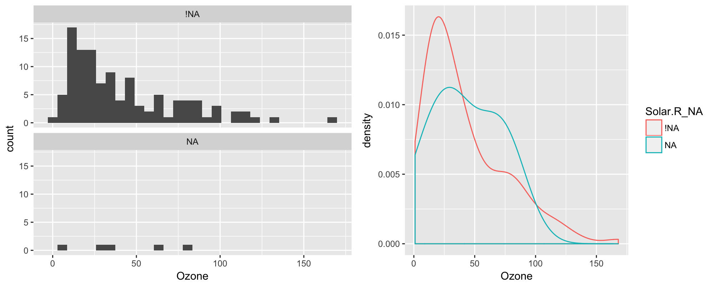
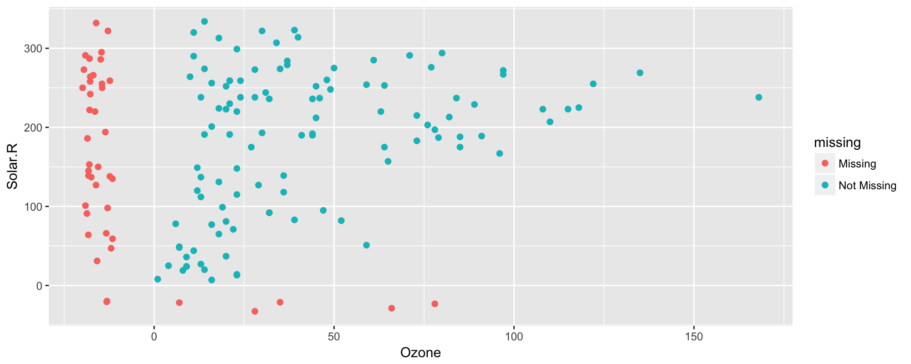

# Expanding ggplot2 for better visual exploration of missing data
Nicholas Tierney & Dianne Cook  


# Introduction

Missing data is ubiquitous in data analysis. ggplot2, an implementation of the grammar of graphics is an incredibly popular way to produce data visualisations does not currently support missing data [@wickham2009ggplot2]. Principles of tidy data [@Wickham2014] states that each row is an observation and each column is a variable, which makes it easy and consistent to perform data manipulation and wrangling. However, there are currently no guidelines for representing additional missing data structures in a tidy format. This paper describes approaches for exploring missing data structure with minimal deviation from the common workflows of ggplot and tidy data structures.

# Types of missing data

Canonical sources of missing data are questionnaires. Data obtained from questionnaires are often subject to both unknown and known missingness structure. Unknown missing data structure may arise from respondents accidentally failing to answer questions or inadvertently providing inappropriate answers. Known missing data structure data may arise due to the structure of the questionnaire. For example, the first question on a survey might be: 'If YES, skip to question 4', resulting in questions 2 and 3 missing. If the structure of the questionnaire is known, this type of missingness can be evaluated easily. However, if this information is not available, the mechanism responsible for producing missing data must be inferred from the data. Longitudinal studies are also sources of missing data, where participants may not return for future testing sessions. In these cases it is difficult, sometimes impossible, to ascertain the reason for the dropouts, and hence, whether the missingness structure is known or unknown.

There are a two approaches to analysis of data with missing values, deletion and imputation. Deletion methods drop variables or cases, depending on the amount of missing data, and imputation methods replace the missing values with some other value estimated from the data. It is now widely regarded as best practice to impute these values, however in order for estimates to be unbiased, it is essential to understand the missingness structure and mechanisms [@Little1988; @Rubin1976; @simon-simonoff; @Schafer2002]. 

## Existing packages for handling missing data

Software focussing on missing data typically focus on imputation or visualisation. Packages such as mice, Hmisc, mi, norm, and Amelia provide functions to facilitate imputation, and use a wide range of methods, from mean or median imputation, to regression or machine learning, to Bayesian methodologies, as well as providing diagnostics on the imputations themselves [@mice; @Hmisc; @mi; @norm; @Amelia].

Missing data visualisation packages include the R package VIM, and the stand alone softwares MANET, ggobi, and MissingDataGUI [@cheng2015; @Unwin1996; @swayne2003ggobi; @vim].  MANET (Missings Are Now Equally Treated), provides univariate visualisations of missing data using linked brushing between a reference plot of the missingness for each variable, and a plot of the data as a histogram or barplot. ggobi extends the univariate linked brushing of MANET to multivariate, using parallel co-ordinate plots. ggobi also provided incoporated missingness into scatterplots, displaying missing values from one variable as 10% below the minimum value on the other axis. MissingDataGUI provides a user interface for exploring missing data structure both numerically and visually. Using a GUI to explore missing data makes it easier to glean valuable insights into important structures, but may then make it hard to incorporate these unscripted insights into reproducible analyses, and may also distract and break the workflow from statistical analysis.

VIM (Visualising and Imputing Missing Data) is an R package that provides methods for both imputation and visualisation of missing data. In particular it provides visualisations that identify observed, imputed, and missing values. VIM also identifies imputed cases by adding a suffix to a variable, so Var1 would have a sibling indicator column, Var1_imp, where each case is TRUE or FALSE to indicate imputation. Although VIM provides R functions to visualise and impute missing data, it's syntax for data manipulation and visualisation is difficult to extend, and does not follow tidy data principles. ggplot2 currently only provides visualisation of missing values for categories treating categories as NA values. For all other plots, ggplot2 prints a warning message of the number of missing values ommited.

There are many ways to explore missing data structure and imputation, however there is no unified methodology to explore, or visualise missing data. We now discuss ways to represent missing data that fit in with the grammar of graphics and tidy data.

# Data structures for missing data

Representing missing data structure is achieed using the shadow matrix, introduced in Swayne and Buja @Swayne1998 [-@Swayne1998]. The shadow matrix is the same dimension as the data, and consists of binary indicators of missingness of data values, where missing is represented as "NA", and not missing is represented as "!NA". Although these may be represented as 1 and 0, respectively. This representation can be seen in figure 1 below, adding the sufic "_NA" to the variables. This structure can also be extended to allow for additional factor levels to be created. For example 0 indicates data presence, 1 indicates missing values, 2 indicates imputed value, and 3 might indicate a particular type or class of missingness, where reasons for missingness might be known or inferred. The data matrix can also be augmented to include the shadow matrix, which facilitates visualisation of univariate and bivariate missing data visualisations. Another format is to display it in long form, which facilitates heatmap style visualisations. This approach can be very helpful for giving an overview of which variables contain the most missingness. Methods can also be applied to rearrange rows and columns to find clusters, and identify other interesting features of the data that may have previously been hidden or unclear. 

\begin{figure}[h]
\centering
\includegraphics[width=270pt]{/Users/tierneyn/Google Drive/ALL THE THINGS/PhD/code/R/jsm2017/diagram.png}
\caption{Representations of missing data structures, and subsequent visualisations}
\end{figure}


## Visualising missing data

**Heatmap**

A missing data heatmap is shown below using the `vis_miss` command from the `visdat` package. This displays the the airquality dataset included in base R, which contains Daily air quality measurements in New York, May to September 1973.


<!-- -->

__Figure 2. Heatmap of missing data using `vis_miss` (left) using clustering on rows and columns (right) .__

Similar approaches have been used in other missing data packages such as VIM, mi, Amelia, and MissingDataGUI. However this plot is created in the ggplot framework, giving users greater control over the plot appearance. The user can also apply clustering of the rows and columns using the `cluster = TRUE` argument (shown on the right).

**Univariate plots split by missingness**

An advantage of the augmented shadow format, where the data and shadow are side by side, is that it allows for examining univariate distributions according to the presence or absence of another variable. The plot below shows the values of Ozone when Solar.R is present and missing, on the left is a faceted histogram, and on the right is an overlayed density.

```
ggplot(data = bind_shadow(airquality),
       aes(x = Ozone)) + 
  geom_histogram() + 
  facet_wrap(~Solar.R_NA,
             ncol = 1)

ggplot(data = bind_shadow(airquality),
       aes(x = Ozone,
           colour = Solar.R_NA)) + 
  geom_density()
```


<!-- -->

__Figure 3., Examining univariate distributions of Ozone according to the presence or absence of Solar Radiation.__

Using this data structure allows for the user to directly refer to the variable for which they want to explore the effect of missingness using the suffix _NA after the variable. In the case above, the user is looking at a histogram of Ozone, but is then able to look at how many Ozone values are affected by Solar.R. In cases where there is no missing data in the variable that they want to "split" the missingness by, the plot simple returns a single facetted plot.

Another method of visualisation can be explored using `geom_missing_point()` from the `ggmissing` package:


```r
ggplot(data = airquality,
       aes(x = Ozone,
           y = Solar.R)) + 
  geom_missing_point()
```

<!-- -->

__Figure 4., Visualising Ozone and Solar Radiation and where they are missing in the other variable.__


This replaces missing values to be 10% below the minimum value, a technique borrowed from ggobi. The missing values are also different colours to make missingness preattentive. In this plot we see that there is a mostly uniform spread of missing values for Solar.R and Ozone. As `geom_missing_point` is a defined geometry for ggplot2, it allows users to have full customisation as they normally would with ggplot.

## Numerical Summaries for missing data

Numerical summaries of missing data are also made easy with some helper functions from the `ggmissing` package, which allows for finding the proportion of missing values in the data overall, in cases, or in variables. This can be done with the `percent_missing_*` functions.


```r
# Proportion elements in dataset that contains missing values
percent_missing_df(airquality)
```

```
## [1] 4.793028
```

```r
# Proportion of variables that contain any missing values
percent_missing_var(airquality)
```

```
## [1] 33.33333
```

```r
 # Proportion of cases that contain any missing values
percent_missing_case(airquality)
```

```
## [1] 27.45098
```

We can also look at the number and percent of missings in each case and variable with `summary_missing_case`, and `summary_missing_var`.


```r
summary_missing_case(airquality) %>% slice(1:5)
```

```
## # A tibble: 5 × 3
##    case n_missing  percent
##   <int>     <int>    <dbl>
## 1     1         0  0.00000
## 2     2         0  0.00000
## 3     3         0  0.00000
## 4     4         0  0.00000
## 5     5         2 33.33333
```

```r
summary_missing_var(airquality)
```

```
## # A tibble: 6 × 3
##   variable n_missing   percent
##      <chr>     <int>     <dbl>
## 1    Ozone        37 24.183007
## 2  Solar.R         7  4.575163
## 3     Wind         0  0.000000
## 4     Temp         0  0.000000
## 5    Month         0  0.000000
## 6      Day         0  0.000000
```

Tabulations of the number of missings in each case or variable can be calculated with `table_missing_case` and `table_missing_var`. 


```r
table_missing_case(airquality)
```

```
## # A tibble: 3 × 3
##   n_missing_in_case n_cases  percent
##               <int>   <int>    <dbl>
## 1                 0     111 72.54902
## 2                 1      40 26.14379
## 3                 2       2  1.30719
```

```r
table_missing_var(airquality)
```

```
## # A tibble: 3 × 3
##   n_missing_in_var n_vars  percent
##              <int>  <int>    <dbl>
## 1                0      4 66.66667
## 2                7      1 16.66667
## 3               37      1 16.66667
```

<!-- it would be really cool if we could implement dplyr `group_by` syntax for the data, to produce summaries of missingness for 1993 and 1997 respectively. -->

# Discussion

In this paper we discussed 

We describe the current packages and software for exploring and visualising missing data.


This is the `bind_shadow` versus computing on the fly with `is_na`

```

ggplot(data = bind_shadow(airquality),
       aes(x = Ozone)) + 
  geom_histogram() + 
  facet_wrap(Solar.R_NA),
             ncol = 1)
             
ggplot(data = airquality,
       aes(x = Ozone)) + 
  geom_histogram() + 
  facet_wrap(is_na(Solar.R),
             ncol = 1)

```

It is important to consider then the implications for storage, when using bind_shadow, and computation, when using the `is_na` approach. `bind_shadow` provides some flexibility and extensibility, as it allows for more complex types of missingness. For example, it could extending from missing, `NA`,and not missing, `!NA`, to extend to different mechanisms for missingness `NA_missing_for_reason_A`, `NA_missing_for_reason_B`, or imputed values `value_imputed`. 

**Limitations**

More research is needed to be done on how to visualise, store, and summarise imputations while staying in a tidy data framework. Multiple imputation could be stored using nested dataframes for each multiple imputation. We didn't discuss how to visualise imputations, but you can imagine a similar framework for labelling imputations in a data structure.


**Future work**

explore model-based approaches for exploring  based missing data structures.

- How does this expand the field?
- How is this different to previous findings / usage?


# References

